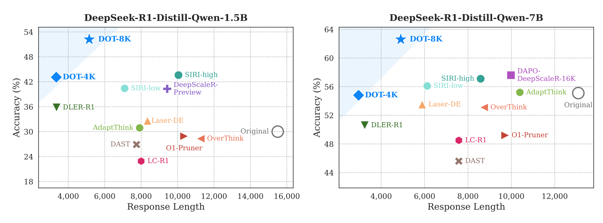

<h2 align="center">Anti-Length Shift: Dynamic Outlier Truncation for Training Efficient Reasoning Models</h2>

<p align="center">
  📄 <a href="https://arxiv.org/abs/2601.03969"><b>Paper</b></a> |
  🤗 <a href="https://hf.co/collections/U-rara/dot"><b>Models</b></a>
</p>

<p align="center">
  Official implementation of Dynamic Outlier Truncation (DOT) for efficient reasoning model training.
</p>



## 🔍 Overview

Large reasoning models trained with reinforcement learning and verifiable rewards often become unnecessarily verbose on simple problems. In our paper, we identify this pathology as **length shift** and introduce **Dynamic Outlier Truncation (DOT)**, a training-time intervention that trims only the extreme tail of response lengths in rollout groups that are already fully correct.

DOT is paired with two auxiliary components:

- **KL-Cov regularization**, which stabilizes exploration when truncation changes the optimization landscape.
- **Predictive Dynamic Sampling**, which adapts the oversampling factor online to maintain an effective batch size as more prompts become easy during training.

The full paper is available at [arXiv:2601.03969](https://arxiv.org/abs/2601.03969).

## 🧠 Method At A Glance

- **Group-conditional truncation**: truncate only when every sampled response in a rollout group is correct.
- **Statistical cutoff**: for response lengths `{L_i}`, use `T(q) = floor(mean(L) + alpha * std(L))`.
- **Minimum reduction margin**: truncate only when `L_i - T(q) >= m`, which avoids noisy micro-edits.
- **Reward recomputation**: rerun the verifier after truncation and keep the GRPO update unchanged.
- **Stable scaling**: add KL-Cov and Predictive Dynamic Sampling to prevent collapse and reduce sampling waste.

## 📊 Main Results

- On AIME-24, DOT reduces token usage by **78%** while improving accuracy over the initial policy.
- DOT consistently shifts the efficiency-performance Pareto frontier outward across 1.5B, 7B, and 32B scales.
- Beyond math benchmarks, DOT also transfers well to code generation benchmarks such as HumanEval and LiveCodeBench.

`DOT-4K` and `DOT-8K` denote the training-time response budget used for the released checkpoint.

## Math Benchmarks

#### DeepSeek-R1-Distill-Qwen-1.5B

| Method | AIME-24 Acc | AIME-24 Len | AIME-25 Acc | AIME-25 Len | AMC Acc | AMC Len | MATH-500 Acc | MATH-500 Len |
| --- | :-: | :-: | :-: | :-: | :-: | :-: | :-: | :-: |
| Original | 30.0 | 15498 | 23.5 | 15604 | 64.1 | 10316 | 84.0 | 5483 |
| DeepScaleR-Preview | 40.3 | 9430 | 30.2 | 9778 | 73.8 | 5538 | 88.9 | 3102 |
| OverThink* | 28.3 | 11269 | — | — | — | — | 81.2 | 4131 |
| DAST* | 26.9 | 7745 | — | — | — | — | 83.0 | 2428 |
| O1-Pruner* | 28.9 | 10361 | — | — | — | — | 82.2 | 3212 |
| LC-R1 | 22.9 | 8000 | 21.0 | 7961 | 60.7 | 4568 | 81.8 | 2362 |
| Laser-DE-L4096 | 32.6 | 8349 | 23.6 | 7839 | 67.5 | 4994 | 84.8 | 2763 |
| AdaptThink | 30.9 | 7917 | 23.3 | 8166 | 63.0 | 3710 | 82.5 | 1964 |
| DLER-R1 | 35.8 | 3354 | 25.6 | 3101 | 73.5 | 2544 | 87.1 | 1777 |
| SIRI-low* | 40.4 | 7093 | 29.6 | 6509 | 74.6 | 4700 | 87.7 | 2881 |
| SIRI-high* | 43.6 | 10049 | 32.2 | 9739 | 75.9 | 7396 | 88.4 | 4633 |
| **DOT-4K (Ours)** | 43.1 | **3342** | 29.2 | **2979** | 77.5 | **2281** | 89.2 | **1249** |
| **DOT-8K (Ours)** | **52.2** | 5151 | **34.2** | 5143 | **80.6** | 3140 | **89.9** | 1423 |

#### DeepSeek-R1-Distill-Qwen-7B

| Method | AIME-24 Acc | AIME-24 Len | AIME-25 Acc | AIME-25 Len | AMC Acc | AMC Len | MATH-500 Acc | MATH-500 Len |
| --- | :-: | :-: | :-: | :-: | :-: | :-: | :-: | :-: |
| Original | 55.1 | 13088 | 39.9 | 14240 | 82.5 | 7668 | 92.2 | 4026 |
| DAPO-DeepScaleR | 57.6 | 9983 | 40.8 | 10705 | 84.5 | 6508 | 92.5 | 3658 |
| OverThink* | 53.1 | 8744 | — | — | — | — | 89.4 | 2435 |
| DAST* | 45.6 | 7578 | — | — | — | — | 89.6 | 2162 |
| O1-Pruner* | 49.2 | 9719 | — | — | — | — | 86.6 | 2534 |
| LC-R1 | 48.5 | 7580 | 35.6 | 7984 | 79.2 | 3765 | 90.1 | 1536 |
| Laser-DE-L4096 | 53.5 | 5890 | 37.4 | 6324 | 83.0 | 3381 | 92.6 | 1883 |
| AdaptThink | 55.2 | 10393 | 38.3 | 11723 | 81.5 | 5177 | 91.0 | 2008 |
| DLER-R1 | 50.6 | 3241 | 33.6 | 3357 | 83.5 | 2262 | 92.4 | 1438 |
| SIRI-low* | 56.1 | 6122 | 41.5 | 6386 | 85.8 | 4015 | 93.5 | 2452 |
| SIRI-high* | 57.1 | 8585 | 45.4 | 9106 | 86.7 | 5773 | 93.7 | 3378 |
| **DOT-4K (Ours)** | 54.8 | **2958** | 41.1 | **2835** | 86.1 | **1836** | 93.4 | **1008** |
| **DOT-8K (Ours)** | **62.6** | 4903 | **48.5** | 5464 | **87.6** | 2779 | **94.3** | 1293 |

#### DeepSeek-R1-Distill-Qwen-32B

| Method | AIME-24 Acc | AIME-24 Len | AIME-25 Acc | AIME-25 Len | AMC Acc | AMC Len | MATH-500 Acc | MATH-500 Len |
| --- | :-: | :-: | :-: | :-: | :-: | :-: | :-: | :-: |
| Original | 72.4 | 10299 | 56.0 | 12385 | 88.9 | 6578 | 94.3 | 3557 |
| Laser-DE-L8192* | 70.8 | 6785 | — | — | — | — | 93.2 | 2314 |
| **DOT-4K (Ours)** | 65.3 | **2622** | 52.5 | **2782** | 87.4 | **1472** | 94.5 | **861** |
| **DOT-8K (Ours)** | **73.2** | 4151 | **59.6** | 5301 | **90.6** | 2786 | **95.0** | 1369 |

## Code Benchmarks

#### DeepSeek-R1-Distill-Qwen-1.5B

| Method | HumanEval Acc | HumanEval Len | LiveCodeBench Acc | LiveCodeBench Len |
| --- | :-: | :-: | :-: | :-: |
| Original | 64.7 | 4377 | 16.4 | 13706 |
| DeepScaleR-Preview | 69.6 | 4657 | 21.0 | 10076 |
| LC-R1 | 59.8 | 2814 | 15.1 | 11128 |
| Laser-DE-L4096 | 64.5 | 2372 | 17.5 | 6223 |
| AdaptThink | 64.4 | 3859 | 17.7 | 11117 |
| DLER-R1 | 68.2 | 2350 | 20.8 | **4132** |
| **DOT-4K (Ours)** | 70.5 | **2306** | 21.7 | 4481 |
| **DOT-8K (Ours)** | **70.7** | 2860 | **22.6** | 6903 |

#### DeepSeek-R1-Distill-Qwen-7B

| Method | HumanEval Acc | HumanEval Len | LiveCodeBench Acc | LiveCodeBench Len |
| --- | :-: | :-: | :-: | :-: |
| Original | 81.9 | 3265 | 31.8 | 9718 |
| LC-R1 | 81.2 | 2173 | 31.4 | 6634 |
| Laser-DE-L4096 | 82.9 | 2118 | 33.0 | 6051 |
| AdaptThink | 81.6 | 2862 | 32.2 | 8767 |
| DLER-R1 | 82.9 | 2118 | 33.0 | 6050 |
| **DOT-4K (Ours)** | 85.0 | **1474** | 33.0 | **3988** |
| **DOT-8K (Ours)** | **85.1** | 2019 | **34.8** | 5979 |

All numbers above follow the paper's evaluation protocol: 32 samples per problem, `temperature=0.6`, `top_p=0.95`, `top_k=20`, and a maximum generation budget of 32,768 tokens.

### Released Checkpoints

- [U-rara/DOT-4K-1.5B](https://huggingface.co/U-rara/DOT-4K-1.5B)
- [U-rara/DOT-8K-1.5B](https://huggingface.co/U-rara/DOT-8K-1.5B)
- [U-rara/DOT-4K-7B](https://huggingface.co/U-rara/DOT-4K-7B)
- [U-rara/DOT-8K-7B](https://huggingface.co/U-rara/DOT-8K-7B)
- [U-rara/DOT-4K-32B](https://huggingface.co/U-rara/DOT-4K-32B)
- [U-rara/DOT-8K-32B](https://huggingface.co/U-rara/DOT-8K-32B)

## 🤗 Model Usage

```bash
pip install -U transformers accelerate
```

```python
from transformers import AutoModelForCausalLM, AutoTokenizer

model_name = "U-rara/DOT-8K-7B"
tokenizer = AutoTokenizer.from_pretrained(model_name)
model = AutoModelForCausalLM.from_pretrained(
    model_name,
    torch_dtype="auto",
    device_map="auto",
)

messages = [
    {
        "role": "user",
        "content": (
            "Solve x^2 - 5x + 6 = 0. "
            "Please reason step by step, and put your final answer within \\boxed{}."
        ),
    }
]

inputs = tokenizer.apply_chat_template(
    messages,
    tokenize=True,
    add_generation_prompt=True,
    return_tensors="pt",
).to(model.device)

outputs = model.generate(
    inputs,
    do_sample=True,
    temperature=0.6,
    top_p=0.95,
    top_k=20,
    max_new_tokens=8192,
)

print(tokenizer.decode(outputs[0], skip_special_tokens=True))
```

## 🗂️ Repository Layout

This repository is a focused extension of `verl v0.6.1`. Most of the upstream training stack remains unchanged; the DOT-specific logic is concentrated in `projects/dot/*`, with only a few lightweight patches to core `verl` for logging and metric plumbing.

### DOT-specific additions

- [`projects/dot/main_dot.py`](projects/dot/main_dot.py) is the DOT training entry point built on Hydra and Ray.
- [`projects/dot/dot_ray_trainer.py`](projects/dot/dot_ray_trainer.py) is the main integration layer that adds Dynamic Outlier Truncation and Predictive Dynamic Sampling on top of the PPO trainer.
- [`projects/dot/length_truncation.py`](projects/dot/length_truncation.py) implements group-wise truncation, reward recomputation, and truncation statistics.
- [`projects/dot/config/dot_trainer.yaml`](projects/dot/config/dot_trainer.yaml) and [`projects/dot/config/algorithm.py`](projects/dot/config/algorithm.py) add DOT-specific configuration fields without modifying the upstream config schema too heavily.
- [`projects/dot/dataset.py`](projects/dot/dataset.py) adapts DeepScaleR, AIME, AMC, and MATH-style datasets into the RL format expected by `verl`.
- [`projects/dot/reward_score/math_reward.py`](projects/dot/reward_score/math_reward.py) provides the rule-based math verifier used in our training setup.
- [`projects/dot/runs/run_dot.sh`](projects/dot/runs/run_dot.sh) is the paper-style launch script with the default hyperparameters from the paper.

### Lightweight changes to `verl`

- [`verl/trainer/ppo/metric_utils.py`](verl/trainer/ppo/metric_utils.py) adds DOT-related logging, including response-length statistics and custom metrics emitted by the trainer.
- [`verl/experimental/reward/reward_loop/naive.py`](verl/experimental/reward/reward_loop/naive.py) exposes response length in reward-side extra info so it can be tracked during training.

### What stays upstream

- The rest of [`verl/`](verl) is kept close to upstream `verl v0.6.1`, including the distributed training stack, rollout workers, and most PPO infrastructure.

## ⚙️ Installation

This repository is built on top of `verl v0.6.1`.

```bash
conda create -n dot python=3.10 -y
conda activate dot
pip install -U pip
pip install -e .
```

For high-throughput training, we recommend using the same backend family as the paper: FSDP for distributed training and SGLang for rollout serving.

## 📚 Dataset

The paper uses:

- Training: [DeepScaleR-Preview](https://pretty-radio-b75.notion.site/DeepScaleR-Surpassing-O1-Preview-with-a-1-5B-Model-by-Scaling-RL-19681902c1468005bed8ca303013a4e2)
- Evaluation: [AIME-24](https://huggingface.co/datasets/Maxwell-Jia/AIME_2024), [AIME-25](https://huggingface.co/datasets/yentinglin/aime_2025), [AMC (AMC-22 and AMC-23)](https://huggingface.co/datasets/AI-MO/aimo-validation-amc), and [MATH-500](https://huggingface.co/datasets/HuggingFaceH4/MATH-500)

## 🚀 Training

The paper runner is [`projects/dot/runs/run_dot.sh`](projects/dot/runs/run_dot.sh).

Training startup is fully consistent with `verl`: we first start a Ray cluster, then launch the training script from any node that can access the cluster. Below is a typical example.

Example Ray startup:

```bash
# on the head node
ray start --head --port=6379

# on each worker node
ray start --address=<HEAD_NODE_IP>:6379
```

Then launch training from any node:

```bash
bash projects/dot/runs/run_dot.sh
```

The launch script is intentionally lightweight and assumes your cluster-specific environment has already been configured, including:

- dataset and checkpoint paths in `projects/dot/runs/run_dot.sh`
- runtime variables such as `GPU_NUM`, `WORLD_SIZE`, and any scheduler-provided node information
- CUDA / NCCL / network environment variables required by your cluster
- any logging or cache environment such as `WANDB_API_KEY`, Hugging Face cache paths, or internal storage mounts

## 📖 Citation

If you find this repository useful, please cite:

```bibtex
@article{wu2026dot,
  title={Anti-Length Shift: Dynamic Outlier Truncation for Training Efficient Reasoning Models},
  author={Wei Wu and Liyi Chen and Congxi Xiao and Tianfu Wang and Qimeng Wang and Chengqiang Lu and Yan Gao and Yi Wu and Yao Hu and Hui Xiong},
  journal={arXiv preprint arXiv:2601.03969},
  year={2026},
  url={https://arxiv.org/abs/2601.03969}
}
```

## 🙏 Acknowledgement

This implementation is built on top of [verl](https://github.com/volcengine/verl).
